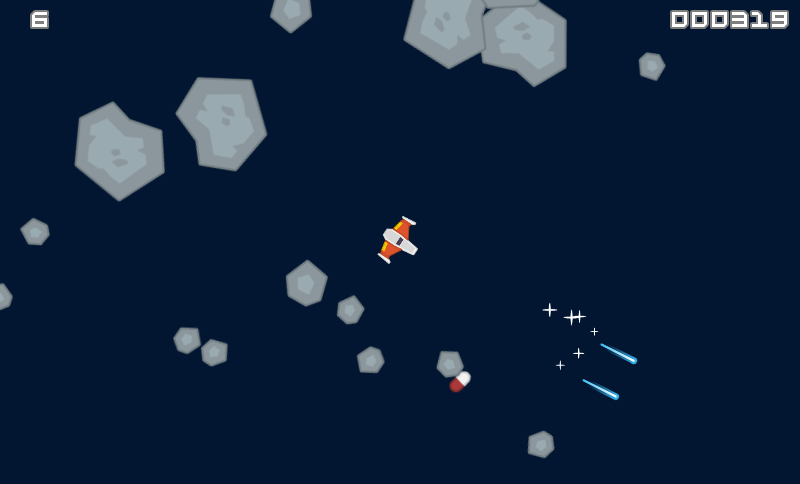

Phaser 3 Space Shooter
=========

A simple 2D shooter exploiting features of the Phaser 3 framework. Created during the [Game Development Middleware course](https://gamedev.cuni.cz/study/fields/game-programming-mff-cuni-cz/) at the MFF at Charles University. Contains basics of the Phaser 3 framework including camera follow, collisions, particle systems and object pooling.
## Code & running

The game build can be found [here](https://star-shooter-ultimate.stackblitz.io/) (hosted by Stackblitz). For an immediate editing of the source code, visit [this page](https://stackblitz.com/edit/star-shooter-ultimate).

## Gameplay
Ship controlled by A, S, D, W. Press SPACE to fire and ESC in order to return to the menu.

  

## Credits

Uses graphics from [Space Shooter Redux](https://www.kenney.nl/assets/space-shooter-redux) created by Kenney released under the 
[CC0 1.0 Universal](https://creativecommons.org/publicdomain/zero/1.0/) license.
